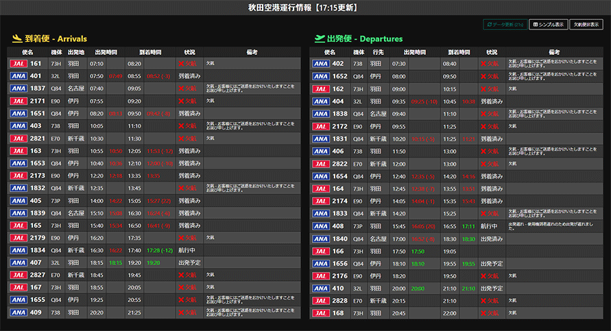

# axt-flight-info

秋田空港発着便（全日空・日本航空）の運行状況を[公共交通オープンデータセンター](https://www.odpt.org/)から取得し表示します。



## Usage

`Dockerfile`、`docker-compose.yml` を同梱していますので、[Docker](https://www.docker.com/get-started) が利用できる場合はすぐに環境を構築できます。

```
docker-compose build
```

npm パッケージをインストールしてください。

```
npm install

# Docker使用の場合:
docker-compose run app npm install
```

公共交通オープンデータセンターからデータをダウンロードするためのアクセストークン（ConsumerKey）を取得し、以下のような内容で `.env` ファイルを作成してください。
（アクセストークンの取得方法は https://developer.odpt.org/ を参照）

```
ODPT_CONSUMERKEY=ここにアクセストークンを入力
```

アプリケーションをビルドし、HTML を静的出力してください。下記コマンドにより `dist/` ディレクトリへ HTML が出力されます。

```
npm run generate

# Docker使用の場合:
docker-compose run --service-ports app npm run generate
```

HTML の出力後は、下記コマンドによりローカルサーバーを起動し `http://localhost:3000` へアクセスして本アプリを利用することができます。

```
npm run start

# Docker使用の場合:
docker-compose run --service-ports app npm run start
```

## License

[MIT License.](./LICENSE)
